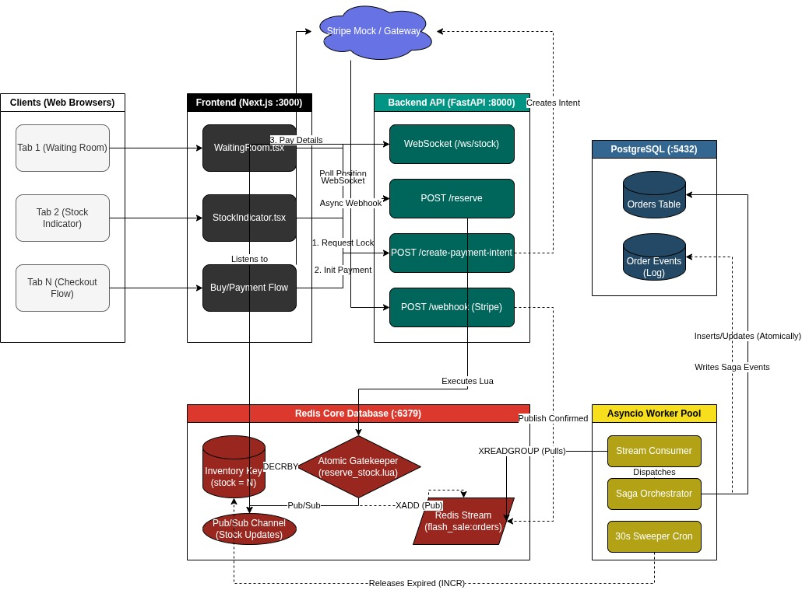
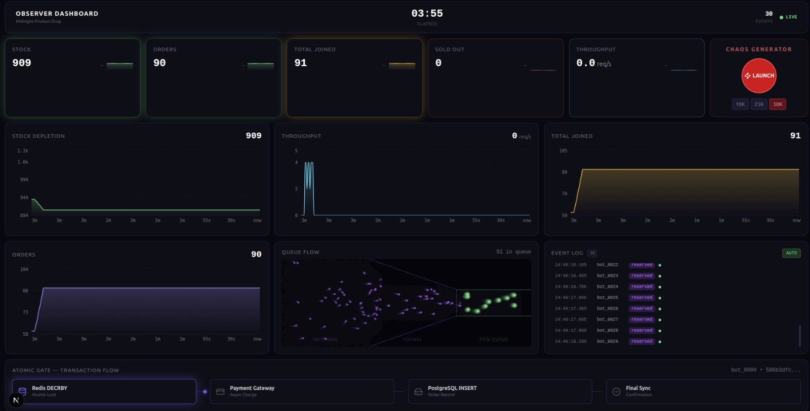

# Midnight Product Drop

High-concurrency flash-sale system that guarantees exactly N successful purchases from limited inventory. Runs entirely on Docker Compose — zero cloud dependencies.

## Architecture

```
┌─────────────┐     ┌─────────────┐     ┌──────────────┐
│  Frontend    │────▶│   API       │────▶│  PostgreSQL   │
│  Next.js 15  │ WS  │  FastAPI    │     │  16 · :5432   │
│  :3000       │◀────│  :8000      │     └──────────────┘
└─────────────┘     └──────┬──────┘
                           │
                    ┌──────▼──────┐
                    │  Redis 7    │
                    │  :6379      │
                    └──────┬──────┘
                           │
                    ┌──────▼──────────┐
                    │  Worker(s)      │
                    │  Stream Consumer │
                    │  + Expiry Sweep  │
                    └─────────────────┘
```


| Service   | Tech          | Port | Role                                 |
|-----------|---------------|------|--------------------------------------|
| api       | FastAPI       | 8000 | HTTP API + WebSocket                 |
| worker    | asyncio       | --   | Stream consumer + expiry sweeper     |
| frontend  | Next.js 15    | 3000 | Countdown, purchase flow, live stock |
| redis     | Redis 7       | 6379 | Inventory, reservations, queues      |
| postgres  | PostgreSQL 16 | 5432 | Durable orders, audit log            |

## Guarantees

- Exactly N successful purchases for N inventory
- Inventory never goes negative (atomic Lua script)
- No double-selling (per-user reservation lock)
- Payment failures return stock (webhook handler)
- Expired reservations return stock (30s sweeper)
- Idempotent order processing (dedup key)

## Prerequisites

- Docker and Docker Compose v2+
- Python 3.11+ (for scripts and tests)
- Node.js 20+ (only for frontend development outside Docker)

## Quick Start

### 1. Clone and Configure

```bash
git clone <repo-url> midnight-product-drop
cd midnight-product-drop
cp .env.example .env
```

### 2. Start All Services

```bash
docker compose up --build -d
```

Wait for all services to be healthy:

```bash
docker compose ps
```

All services should show `healthy` status. The database schema and seed data are applied automatically on first start via `db/init.sql`.

### 3. Preload Inventory

```bash
python scripts/preload_inventory.py --product-id a0eebc99-9c0b-4ef8-bb6d-6bb9bd380a11 --stock 100
```

### 4. Open the App

- Frontend: http://localhost:3000
- API health: http://localhost:8000/health
- API docs (Swagger): http://localhost:8000/docs

### 5. Run Load Test

```bash
pip install locust
locust -f scripts/locustfile.py --host=http://localhost:8000
```

Open http://localhost:8089 for the Locust web UI.

## Simulating a Midnight Drop

### Pre-Sale Checklist

1. All services running: `docker compose ps` shows 5 healthy services
2. Inventory loaded: `python scripts/preload_inventory.py --stock 100`
3. Frontend shows countdown timer at http://localhost:3000
4. WebSocket connected (green dot on stock indicator)

### Running the Simulation

1. Open http://localhost:3000 in multiple browser tabs or incognito windows
2. When the countdown hits zero, each tab auto-redirects to the waiting room
3. Users receive JWT tokens in FIFO order and can attempt a purchase
4. Each user can reserve exactly 1 unit (enforced by Lua script)
5. Payment completes via mock provider (auto-succeeds)
6. Monitor stock dropping in real-time via the WebSocket stock indicator

### Simulating Thousands of Users

For headless mode with 2000 concurrent users:

```bash
locust -f scripts/locustfile.py \
  --host=http://localhost:8000 \
  --users 2000 \
  --spawn-rate 200 \
  --headless \
  --run-time 2m
```

### Verifying Results

```bash
# Check order counts by status
docker compose exec postgres psql -U midnight -d midnight_drop \
  -c "SELECT status, count(*) FROM orders GROUP BY status;"

# Check Redis inventory (should be 0 if all stock sold)
docker compose exec redis redis-cli \
  GET flash_sale:product:a0eebc99-9c0b-4ef8-bb6d-6bb9bd380a11:inventory

# Run full reconciliation
python scripts/reconcile.py
```

### What to Watch During Load Tests

- `/reserve` latency should be under 50ms P99 (Lua scripts are single-threaded atomic)
- Zero overselling: confirmed orders must never exceed original stock
- No 5xx errors on any endpoint
- Worker stream processing keeps up (no growing pending count)

## Scaling Workers

Workers consume from a Redis Streams consumer group. Each scaled instance gets a unique consumer name derived from its Docker container hostname, so messages are distributed across workers automatically.

### Scale to 3 Workers

```bash
docker compose up --scale worker=3
```

### Verify Consumer Group

```bash
docker compose exec redis redis-cli \
  XINFO GROUPS flash_sale:orders:a0eebc99-9c0b-4ef8-bb6d-6bb9bd380a11
```

You should see 3 consumers in the `order_workers` group. Each worker container has a unique consumer name like `order_consumer_abc123def456`.

### How Scaling Works

- Docker sets each container's `HOSTNAME` to a unique container ID
- `worker/main.py` uses `socket.gethostname()` to construct a unique consumer name
- Redis Streams consumer groups deliver each message to exactly one consumer in the group
- The expiry sweeper runs on all workers, but the release Lua script is idempotent (no double-release)

## Payment

Uses Stripe test mode. Set `STRIPE_SECRET_KEY` and `STRIPE_WEBHOOK_SECRET` in `.env`.
If unset, the system falls back to a mock payment provider that auto-succeeds.

Test card: `4242 4242 4242 4242`

## System Flow

```
PRE-SALE          WAITING ROOM        RESERVE           PAY              CONFIRM
preload script -> ZADD waiting_room -> Lua EVALSHA   -> Stripe Intent -> Webhook
SET inv = N      ZRANK position      DECRBY inv       or mock           INSERT order
                 Issue JWT token     SET user lock                      XACK stream
                                    HSET reservation
                                    XADD order stream
```

## Compensation

| Trigger             | Action                                       |
|---------------------|----------------------------------------------|
| Payment fails       | Webhook -> INCRBY stock, DEL user lock        |
| Reservation expires | Sweeper (30s) -> INCRBY stock, DEL user lock  |

## Operational Scripts

| Script                         | Purpose                               | Usage                                          |
|--------------------------------|---------------------------------------|-------------------------------------------------|
| `scripts/preload_inventory.py` | Load stock into Redis, activate sale  | `python scripts/preload_inventory.py --stock 100` |
| `scripts/reconcile.py`         | Compare Redis vs Postgres state       | `python scripts/reconcile.py`                   |
| `scripts/expire_reservations.py` | Manually release expired reservations | `python scripts/expire_reservations.py --dry-run` |
| `scripts/locustfile.py`        | Load test (1000+ users)               | `locust -f scripts/locustfile.py`               |
| `scripts/reset_all.sh`         | Flush Redis + truncate Postgres       | `bash scripts/reset_all.sh`                     |
| `scripts/run_migrations.py`    | Apply database schema changes         | `python scripts/run_migrations.py`              |

## Running Tests

```bash
# Install dependencies
pip install -r requirements.txt

# Start test infrastructure (Redis + Postgres)
docker compose up redis postgres -d

# Run all tests
pytest tests/ -v

# Run specific test suites
pytest tests/unit/ -v              # Unit tests (Lua scripts, tokens, etc.)
pytest tests/integration/ -v       # Integration tests (full flows)
pytest tests/test_reserve.py -v    # HTTP endpoint tests
pytest tests/test_saga.py -v       # Saga orchestrator tests
```

## Project Structure

```
midnight-product-drop/
├── api/                    # FastAPI service (:8000)
│   ├── lua/                # Atomic Lua scripts (reserve, release)
│   ├── routers/            # HTTP + WebSocket endpoints
│   ├── services/           # Business logic
│   ├── middleware/          # Auth, rate limit, idempotency
│   └── models/             # Pydantic schemas
├── worker/                 # Asyncio stream consumer + sweeper
│   ├── handlers/           # Order confirm, reservation release
│   ├── saga.py             # Multi-step transaction orchestrator
│   └── consumer.py         # Redis Streams consumer
├── frontend/               # Next.js 15 (:3000)
│   ├── app/                # 6 pages (/, /waiting-room, /buy, /payment, /success, /sold-out)
│   ├── components/         # UI components
│   ├── hooks/              # WebSocket, reservation state machine
│   └── lib/                # API client, types
├── internal/               # Shared Python utilities
│   ├── constants.py        # Redis key patterns, TTLs
│   ├── redis_client.py     # Connection pool + Lua script loader
│   ├── db_client.py        # asyncpg pool factory
│   └── logging.py          # structlog setup
├── db/                     # Schema + seed data
├── scripts/                # Operational tools
├── tests/                  # Unit, integration, and load tests
├── docker-compose.yml      # 5-service stack
└── .env.example            # All configuration variables
```

## Reset

```bash
bash scripts/reset_all.sh
```

This flushes Redis and truncates Postgres order tables. Run `preload_inventory.py` again to set up a new sale.

## Future Production Notes

What would change for a real deployment:

- **Orchestration**: Replace Docker Compose with Kubernetes or ECS for auto-scaling and self-healing
- **Managed Data Stores**: Use ElastiCache/Upstash for Redis, RDS/Neon for PostgreSQL
- **Secrets Management**: Move `JWT_SECRET`, `STRIPE_SECRET_KEY` to AWS Secrets Manager or Vault (not `.env`)
- **Real Payments**: Configure real Stripe keys, register a public webhook URL
- **TLS**: Add nginx or ALB for TLS termination in front of the API
- **Monitoring**: Prometheus metrics on all services, Grafana dashboards for stock/orders/latency
- **Tracing**: OpenTelemetry instrumentation for distributed request tracing
- **Redis HA**: Redis Sentinel or Cluster for high availability
- **CDN**: Deploy frontend to Vercel or Cloudflare for global edge delivery
- **Rate Limiting**: Add IP-based rate limiting at the load balancer level in addition to per-user limits
- **Horizontal Scaling**: Auto-scale API replicas based on CPU/request rate, scale workers based on stream lag

## Observer's Dashboard



